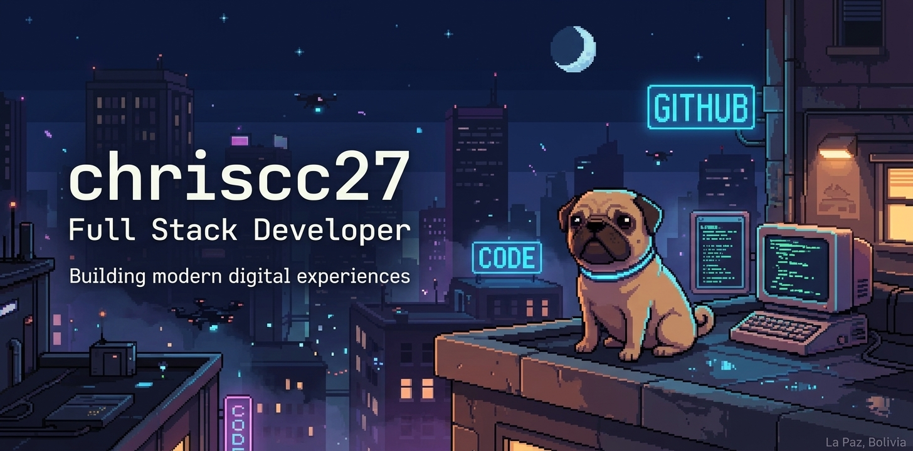

  

---

  <h1 align="center" style="font-size: 36px;">Hi, I'm Christian Coronel 👋</h1>

  

  

---

### 🧘 About me

I am almost a systems engineer from the **Catholic University of Bolivia**. I was born and raised in **La Paz, Bolivia** – a city with an altitude that gives you a unique perspective on life and code.  
I love building things that work, learning by doing, and maintaining a relaxed but focused mindset. I am motivated by clean code, cloud technologies, and constant improvement.

📫 **chriscoronelc27@gmail.com** · [LinkedIn](https://www.linkedin.com/in/christian-coronel-85b0b9383/)

---

### 🧰 Tech Stack

---

### 📊 GitHub Stats

  

---

### 🐍 My contributions

  <picture>
    <source media="(prefers-color-scheme: dark)" srcset="https://raw.githubusercontent.com/chriscc27/chriscc27/main/dist/snake-dark.svg">
    <source media="(prefers-color-scheme: light)" srcset="https://raw.githubusercontent.com/chriscc27/chriscc27/main/dist/snake.svg">
    
  </picture>

